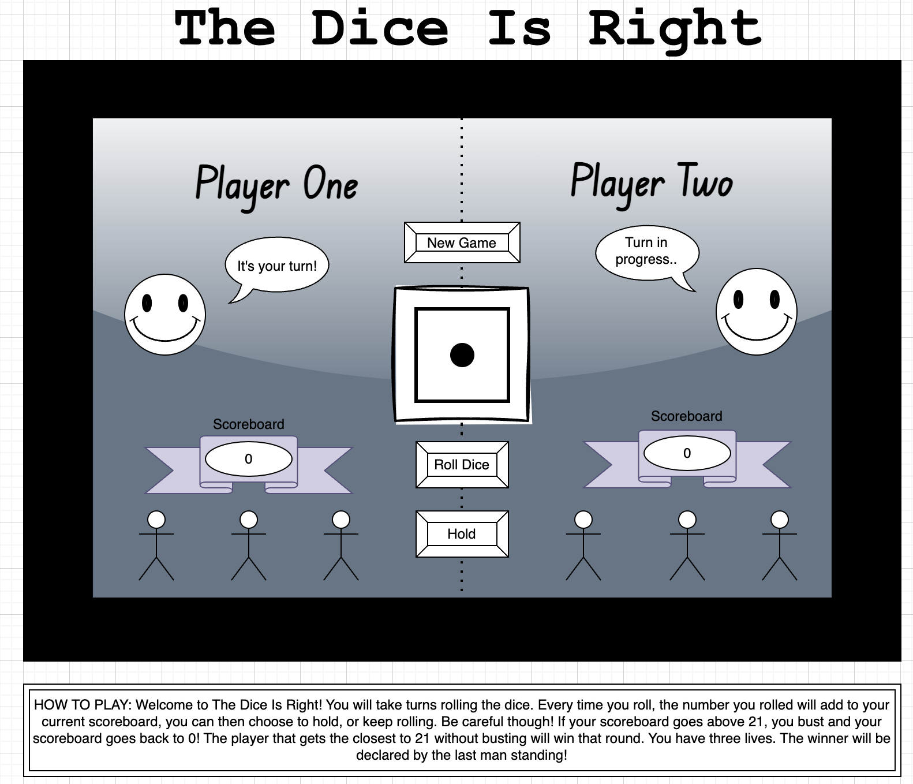

# The Dice Is Right
 
 Welcome to The Dice Is Right! You will take turns rolling the dice. Every time you roll, the number you roll will add to your scoreboard, you can choose to hold your scoreboard number and end your turn, or roll again. Be careful though! If your scoreboard gets above 21, you will bust and your score will go back to 0! The player that gets closest to 21 without busting will win that round. You have three lives, the winner will be declared by last man standing!

Here is the link! https://github.com/Dxk0ta/project-1.git

## Getting Started

Started laying down to wireframe and getting an idea of what this game will be. Once 

### MVP Goals

* Make sure everything is running smoothly together and there are no bugs
* Game instructions are clear
* Keeping code neet and organized for an easy ready
* Making sure all my responses work 

### Stretch Goals

* I LOVE styling, my biggest goal after finishing the project requirements and messing around with CSS, Javascript and draw.io as much as I can to implament as much beauty into the game as possible
* Work on side projects such as displaying a message in the players "message bubble" telling players whos turn it is, and messages when players win or lose.
* Naming each "life" and sending a message to the player (for example) "you killed pepe!"
* When player loses a turn, one of his men will get crossed out with a red X.
* I may mess around and put in an input section for each player to type there name in and fill the "Player one" "Player two" text
* I would really like to get AI's involved as well

### Potential Road Blocks

* Getting way to invested into what I'm doing to the point that I will spend hours trying to fix something before I delete it and write something else.
* Organization skills

### Prerequasites 

* HTML
* CSS
* Javascript

## The Process of The Dice Is Right

The first thing I did was plan out what I invisioned the outcome to be. This started in my head, then slowly worked its way to the computer using wireframe to make the blueprints.

